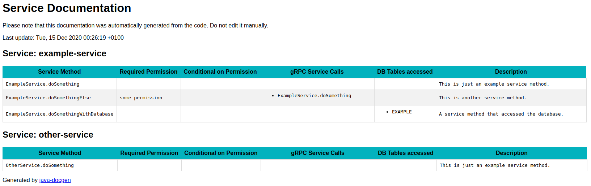

# Java DocGen
The goal of Java DocGen is to automatically document the inner workings of your Java Microservices by using static code analysis.
In order to do so, it combines information extracted from the Java source code files with information extracted from the compiled `.class` files.

In its initial version Java DocGen makes a number of assumptions:
 
 - The service is assumed to expose a gRPC API with base classes generated by the [protoc-jar-maven-plugin](https://github.com/os72/protoc-jar-maven-plugin).
 - The service is further assumed to use [jOOQ](https://www.jooq.org/) to access the database.
 - Finally, the service is expected to be packaged as a Spring Boot fat JAR.
 
## Features
Java DocGen will create a report either in HTML or Markdown format.

For each service method, it will report:

 - the required permission to access it (`@PreAuthorize` annotation)
 - any further permission check within the code body
 - other gRPC services called (fan out)
 - database tables accessed
 - a comment describing the service method

## Example Output

## Building from Source
`mvn clean package`

## Usage
Java DocGen expects a single argument pointing to a [JSON config file](#config-file).

`java -cp target/java-docgen-1.0-SNAPSHOT-jar-with-dependencies.jar ch.retomock.docgen.Main config.json`

### Config File
The `config.json` file has the following structure:

| Field | Description |
|-|-|
| projectRootDirectory | Root directory of the Java project to be analyzed |
| javaDocSourceDirectories[] | Java source code directories to be scanner for JavaDoc comments (relative to `projectRootDirectory`) |
| basePackage | Base package of your company / project |
| modules[] | Modules to be analyzed |
| modules[].name | Name of the module (used for display purposes only) |
| modules[].sourceCodeFolder | Folder containing the Java source code files (relative to `projectRootDirectory`) |
| modules[].servicePackage | Java package containing the classes that extend the generated gRPC `*ImplBase` classes |
| jarRepositoryPath | Base path where the JAR files are located. E.g. /home/your-name/.m2/repository |
| jarsToAnalyze[] | JARs to Analyze (relative to `jarRepositoryPath`) |
| outputFile | File where to write the output to (supported formats: `.html` or `.md`) |

There is an example [config.json](config.json) file in the root folder of this project.

### Testing with the example service
- `cd example-service && mvn clean install`
- Update the paths in `config.json`

## TODOs / Ideas
 - Add support for "default" methods in interfaces
 - Add links to source code
 - List method callers (if less than N)
 
